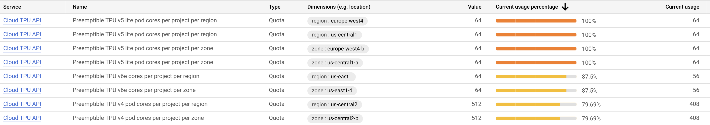
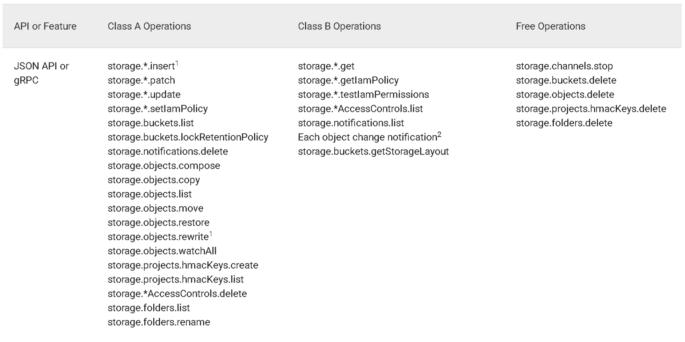

# TPU-Manual

Contacts: For any questions regarding the setup or usage of the TPU, please contact Boya Zeng or Taiming Lu via email, Slack, or Messenger. Please make sure to send a message on Messenger (instead of only sending a friend request on Facebook) for us to see it.

The content of this manual is composed by [Boya Zeng](https://boyazeng.github.io), [Yufeng Xu](https://zephyr271828.github.io), and [Taiming Lu](taiminglu.com). For any TPU issues, please contact Boya or Taiming through Slack or Messenger.

**It’s important to carefully track TPU usage costs. See the [Cost](#cost) section for key considerations and the [Job Requirements](#job-requirements) section for general rules on submitting jobs.**


## Overview
This manual is a guide for using the Google Cloud TPU in Zhuang's group at Princeton University.

You can access this [slides](https://docs.google.com/presentation/d/1AaRlwMk87DRO-bsk1o1tqVCVyZC6mI0SCK1FvMya3Hw/edit?usp=sharing) to see general introduction to TPU, Google Cloud, and Jax.

TPUs are specialized high-performance computing resources optimized for large-scale machine learning workloads. We have access to multiple TPU generations and topologies, including v3, v4, v5e, and v6e pods, with both preemptible and on-demand configurations available depending on quota and project access.

## Table of Contents

- [TPU-Manual](#tpu-manual)
  - [Overview](#overview)
  - [Table of Contents](#table-of-contents)
  - [Setup](#setup)
  - [Quick Launch](#quick-launch)
    - [Set Variables and Check Quotas](#set-variables-and-check-quotas)
    - [Request a TPU-VM](#request-a-tpu-vm)
    - [Install environment](#install-environment)
    - [Training](#training)
    - [Remove the requested TPU-VM](#remove-the-requested-tpu-vm)
  - [TPU introduction](#tpu-introduction)
    - [Workflow](#workflow)
    - [TPU Specifications](#tpu-specifications)
      - [TPU Hardware Specifications](#tpu-hardware-specifications)
      - [Performance Benchmarks (Llama2 7B)](#performance-benchmarks-llama2-7b)
  - [Google Cloud Project Introduction](#google-cloud-project-introduction)
    - [Quota](#quota)
      - [Resource Types](#resource-types)
      - [Effective Quota Estimation](#effective-quota-estimation)
      - [Checking Quotas via Command Line](#checking-quotas-via-command-line)
      - [Available Regions and Zones](#available-regions-and-zones)
      - [Group Resources](#group-resources)
  - [Google Cloud Commands](#google-cloud-commands)
    - [Running on a TPU VM](#running-on-a-tpu-vm)
  - [Storage](#storage)
    - [Cloud storage buckets](#cloud-storage-buckets)
    - [Durable block storage](#durable-block-storage)
  - [Other Helpful Resources](#other-helpful-resources)
  - [Cost](#cost)
    - [General Rules](#general-rules)
    - [Specific Cost Rates](#specific-cost-rates)
      - [(1) Cloud storage cost](#1-cloud-storage-cost)
      - [(2) Networking cost](#2-networking-cost)
      - [(3) Compute engine cost](#3-compute-engine-cost)
    - [Monitoring](#monitoring)
  - [Job Requirements](#job-requirements)
    - [Naming](#naming)
  - [Tools](#tools)

## Setup
In order to use Jobman, you need to make sure `gcloud` is available on your machine in the first place. You may refer to [the official doc](https://cloud.google.com/sdk/docs/install) to do so.  
Afterwards, also install `alpha` and `beta`:
```bash
gcloud components install alpha beta
```


## Quick Launch

 **Important**: Check your project's TPU quotas before requesting resources to avoid quota exceed.

### Set Variables and Check Quotas
Before starting, set these variables to match your project configuration.


You need to go to Google cloud console - Compute Engine - SSH Keys to upload your public key.

```bash
# Set your project and TPU configuration variables
export PROJECT_ID="your-project-id"                    # Your Google Cloud project ID
export TPU_NAME="example_tpu"                          # Name for your TPU VM
export ZONE="zone"                           # Zone where TPU will be created
export ACCELERATOR_TYPE="type"                        # TPU type (v3-32, v4-8, v5e-4, etc.)
export SSH_KEY_FILE="key"     # Path to your SSH key

# Check your current TPU quotas
gcloud compute project-info describe --project=${PROJECT_ID} --format="table(quotas.metric,quotas.limit,quotas.usage)"
```

<!-- **Quota Considerations:**
- Ensure you have sufficient TPU quota for your requested accelerator type
- Check both regional and zonal quotas for your chosen zone
- Consider using preemptible TPUs if you have limited quota
- Contact your administrator if you need quota increases -->

### Request a TPU-VM
Creates a TPU virtual machine with specified configuration. This allocates the hardware resources you'll use for training.
```bash
# Set your Google Cloud project ID
gcloud config set project ${PROJECT_ID}

# Create a TPU VM using the variables defined above
gcloud compute tpus tpu-vm create ${TPU_NAME} \
  --zone=${ZONE} \                           # Geographic location for the TPU
  --accelerator-type=${ACCELERATOR_TYPE} \   # TPU type from variables
  --version=tpu-ubuntu2204-base              # Operating system image
```

### Install environment
Downloads and installs Miniconda (lightweight Python package manager) on all TPU workers.
```bash
# SSH into TPU VM and run commands on all workers
gcloud alpha compute tpus tpu-vm ssh ${TPU_NAME} \
--zone=${ZONE} \                             # Same zone as TPU creation
--ssh-key-file=${SSH_KEY_FILE} \             # SSH authentication key
--worker=all \                               # Execute on all TPU workers
--command "mkdir -p ~/miniconda3 && \        # Create miniconda directory
wget https://repo.anaconda.com/miniconda/Miniconda3-latest-Linux-x86_64.sh -O ~/miniconda3/miniconda.sh && \  # Download miniconda installer
bash ~/miniconda3/miniconda.sh -b -u -p ~/miniconda3 && \  # Install miniconda silently
rm ~/miniconda3/miniconda.sh && \            # Clean up installer file
source ~/miniconda3/etc/profile.d/conda.sh && \  # Load conda environment
conda init"                                  # Initialize conda for shell
```

Sets up Python environment with JAX and TPU-specific dependencies for machine learning.
```bash
# SSH into TPU VM and install ML environment
gcloud alpha compute tpus tpu-vm ssh ${TPU_NAME} \
--zone=${ZONE} \                             # Same zone as TPU creation
--ssh-key-file=${SSH_KEY_FILE} \             # SSH authentication key
--worker=all \                               # Execute on all TPU workers
--command "source ~/miniconda3/etc/profile.d/conda.sh && \  # Load conda
conda tos accept --override-channels --channel https://repo.anaconda.com/pkgs/main && \  # Accept terms for main channel
conda tos accept --override-channels --channel https://repo.anaconda.com/pkgs/r && \     # Accept terms for R channel
conda create -n mnist_env python=3.8 -y && \ # Create Python 3.8 environment
conda activate mnist_env && \                # Activate the environment
python -m pip install -U pip && \            # Upgrade pip package manager
python -m pip install "jax[tpu]==0.4.6" -f https://storage.googleapis.com/jax-releases/libtpu_releases.html && \  # Install JAX with TPU support
cd tpu_intro && \                            # Navigate to project directory
python -m pip install -r requirements.txt"  # Install project dependencies
```

### Training
Downloads the training code repository to the TPU virtual machine.
```bash
# SSH into TPU VM and clone the repository
gcloud alpha compute tpus tpu-vm ssh ${TPU_NAME} \
--zone=${ZONE} \                             # Same zone as TPU creation
--ssh-key-file=${SSH_KEY_FILE} \             # SSH authentication key
--worker=all \                               # Execute on all TPU workers
--command "git clone https://github.com/boyazeng/tpu_intro"  # Clone the code repository
```

To training using multiple workers, 
you can run the training script across all TPU workers for distributed training.
```bash
# SSH into TPU VM and start training
gcloud alpha compute tpus tpu-vm ssh ${TPU_NAME} \
--zone=${ZONE} \                             # Same zone as TPU creation
--ssh-key-file=${SSH_KEY_FILE} \             # SSH authentication key
--worker=all \                               # Execute on all TPU workers
--command "cd tpu_intro && \                 # Navigate to project directory
source ~/miniconda3/etc/profile.d/conda.sh && \  # Load conda environment
conda activate mnist_env && \                # Activate Python environment
python quick_start.py"                       # Run the training script
```

### Remove the requested TPU-VM
Deletes the TPU virtual machine to stop billing and free up resources.
```bash
# Delete the TPU VM to stop charges
gcloud compute tpus tpu-vm delete ${TPU_NAME} --zone=${ZONE}
```


## TPU introduction

This section provides essential terminology and concepts you need to understand when working with Google Cloud TPUs. These definitions will help you navigate the TPU ecosystem and effectively utilize the available resources for your machine learning projects.


- **TPU (Tensor Processing Unit)**: Google’s hardware for fast machine learning (like a GPU, but optimized for deep learning).
- **TPU VM**: A virtual machine that you log into to run code directly on TPUs. Each TPU VM is associated with one or more TPUs, and you can request them from Google Cloud.
- **TPU Pod**: A cluster of many TPUs connected together with high-speed interconnects for large-scale distributed training.
- **Host**: The CPU machine (TPU VM) that manages and communicates with TPUs. In a pod configuration, there are multiple hosts, each managing a subset of the TPUs.
- **External IP**: The public IP address used to SSH into TPU VMs from your local computer.
- **Internal IP**: Private IP addresses used for communication between TPUs and hosts within the same pod or network.
- **Bucket**: Google Cloud Storage (GCS) containers where you store datasets, logs, and checkpoints. Note you only have 100G disk space on each TPU VM (host), so it's necessary to store your large files in a bucket first, then access it by mounting to your VM or by using [gsutil](https://cloud.google.com/storage/docs/gsutil).
- **SSH Key**: Cryptographic keys required for secure SSH connections to TPU VMs and for inter-host communication in multi-host distributed training jobs.
- **Region**: A large geographic area (e.g., us-central1, europe-west4) containing Google Cloud resources. _Buckets are tied to a specific region, meaning data is physically stored there_.
- **Zone**: A smaller location within a region (e.g., us-central1-b). _TPUs are created in zones_.

```
                ┌──────────────────────────────────────────────┐
                │                 REGION                       │
                │              (e.g., us-central1)             │
                │                                              │
                │  ┌────────────────┐     ┌─────────────────┐  │
GCS Bucket ───▶ │  │  GCS BUCKET    │     │     ZONE A      │  │
 (lives at      │  │ (your bucket)  │     │  ┌──────────┐   │  │
                │  └────────────────┘     │  │ TPU VM 1 │   │  │
                │                         │  └──────────┘   │  │
                │                         │  ┌──────────┐   │  │
                │                         │  │ TPU VM 2 │   │  │
                │                         │  └──────────┘   │  │
                │                         └─────────────────┘  │
                │                                              │
                │                         ┌─────────────────┐  │
                │                         │     ZONE B      │  │
                │                         │ (us-central1-b) │  │
                │                         │  ┌──────────┐   │  │
                │                         │  │ TPU VM 3 │   │  │
                │                         │  └──────────┘   │  │
                │                         └─────────────────┘  │
                └──────────────────────────────────────────────┘
```

### Workflow

The usual workflow of using TPUs is: 
1. Request a TPU VM with the desired TPU type and configuration through Google Cloud Console or gcloud CLI, 
2. SSH into the TPU VM using your external IP and SSH key and control TPUs using your local machine, 
3. Set up your environment and install necessary dependencies,
4. Upload your datasets and code to a GCS bucket or mount the bucket to your VM, 
5. Run your machine learning training jobs using frameworks like JAX, PyTorch XLA, or TensorFlow that are optimized for TPUs
6. Monitor your training progress and save checkpoints to the GCS bucket for persistence.

### TPU Specifications

The TPU versions we have access to are v2, v3, v4, v5e, and v6e. Understanding the specifications of each TPU generation is crucial for selecting the right hardware for your workload and optimizing your training jobs.

#### TPU Hardware Specifications

| TPU version | #core per chip | #process per chip | TPU memory per process | #chips per worker (vk-8 and above) |
|-------------|----------------|-------------------|------------------------|-------------------------------------|
| v3          | 2              | 2                 | 16 GB                  | 4                                   |
| v4          | 2              | 1                 | 32 GB                  | 4                                   |
| v5e         | 1              | 1                 | 16 GB                  | 4                                   |
| v6e         | 1              | 1                 | 32 GB                  | 4                                   |

**Key specifications to consider:**
- **Memory per process**: Determines the maximum model size you can train on a single TPU core
- **Cores per chip**: Affects parallelization within a single TPU chip
- **Processes per chip**: Number of independent training processes that can run simultaneously
- **Chips per worker**: For multi-chip configurations (vk-8 and above), this determines the total compute power

#### Performance Benchmarks (Llama2 7B)

| Device    | Tokens/s | Tokens/h | Tokens/day | Comparison |
|-----------|----------|----------|------------|------------|
| L40 (GPU) | 1,146    | 4.1M     | 0.10B      | 45%        |
| A100 (GPU)| 2,570    | 9.3M     | 0.22B      | 100%       |
| H100 (GPU)| 3,855    | 13M      | 0.33B      | 150%       |
| v2-1 (TPU)| 305      | 1.1M     | 0.03B      | 12%        |
| v3-1 (TPU)| 608      | 2.2M     | 0.05B      | 24%        |
| v4-1 (TPU)| 1,079    | 3.9M     | 0.09B      | 42%        |
| v5-1 (TPU)| 1,021    | 3.7M     | 0.08B      | 40%        |
| v6-1 (TPU)| 3,627    | 13M      | 0.31B      | 141%       |

*Note: Numbers reported are per GPU chip/TPU core. A100 is used as the 100% baseline for comparison.*


- **v6e TPUs** offer competitive performance, reaching 141% of A100 performance
- **v4 and v5e** provide moderate performance suitable for many workloads
- **v2 and v3** are older generations with limited performance for modern LLM training
- Choose TPU version based on your model size, training time requirements, and cost considerations


## Google Cloud Project Introduction

Each Google Cloud project has several considerations that affect your TPU usage. Understanding these constraints is crucial for successful resource allocation and cost management.

### Quota

Each project has different effective quotas that constrain your usage.

To start, check your TPU quotas at the [Google Cloud Console](https://console.cloud.google.com/iam-admin/quotas). You may see something like this:



#### Resource Types

| Resource Type | Description | Runtime Limit | Cost | Best For |
|---------------|-------------|---------------|------|----------|
| **On-demand** | Guaranteed resources that won't be preempted | Unlimited | Highest | Production workloads, long training jobs |
| **Spot** | Preemptible resources with queuing capability | >24 hours | Lowest | Development, fault-tolerant workloads |
| **Preemptible** | Legacy preemptible resources | 24 hours max | Low | Short-term experiments |

**Key Differences:**
- **Spot resources** are the newer version of preemptible resources and generally preferred than preempt.
- **Spot VMs** can be queued and last >1 day, while preemptible VMs cannot
- **On-demand resources** provide guaranteed availability but at higher cost

#### Effective Quota Estimation

Your usable TPU cores are limited by these factors (in order of impact):

1. **External IP Address Quota**: Typically 8 per zone
2. **TPU Core Quota**: Maximum cores allowed in your chosen zone
3. **Resource Type Separation**: Pod cores (v4-16+) and regular cores (v4-8) may have separate quotas
4. **Availability**: Physical TPU availability in the zone

**Example**: If you have 32 v4-8 cores quota but only 8 external IPs, you can only use 8 cores effectively.

#### Checking Quotas via Command Line

Use this command to check specific quota limits:

```bash
gcloud beta quotas info describe {RESOURCE_NAME} --service=tpu.googleapis.com --project={PROJECT_ID}
```

**Common TPU Quota Resources:**

| TPU Version | Resource Type | Scope | Resource Name |
|-------------|---------------|-------|---------------|
| v5e | On-demand | Region | `TPUV5sLitepodPerProjectPerRegionForTPUAPI` |
| v5e | On-demand | Zone | `TPUV5sLitepodPerProjectPerZoneForTPUAPI` |
| v5e | Spot/Preemptible | Region | `TPUV5sPreemptibleLitepodPerProjectPerRegionForTPUAPI` |
| v5e | Spot/Preemptible | Zone | `TPUV5sPreemptibleLitepodPerProjectPerZoneForTPUAPI` |
| v6e | On-demand | Region | `TPUV6EPerProjectPerRegionForTPUAPI` |
| v6e | On-demand | Zone | `TPUV6EPerProjectPerZoneForTPUAPI` |
| v6e | Spot/Preemptible | Region | `TPUV6EPreemptiblePerProjectPerRegionForTPUAPI` |
| v6e | Spot/Preemptible | Zone | `TPUV6EPreemptiblePerProjectPerZoneForTPUAPI` |

#### Available Regions and Zones

| Region | Available Zones |
|--------|----------------|
| **Africa** | south1 |
| **Asia** | east1, east2, northeast1, northeast2, northeast3, south1, south2, southeast1, southeast2 |
| **Australia** | southeast1, southeast2 |
| **Europe** | central2, north1, north2, southwest1, west1, west2, west3, west4, west6, west8, west9, west10, west12 |
| **Middle East** | central1, central2, west1 |
| **North America** | northeast1, northeast2, south1 |
| **South America** | east1, west1 |
| **United States** | central1, east1, east4, east5, south1, west1, west2, west3, west4 |

**Reference**: [Google Cloud Regions and Zones](https://cloud.google.com/compute/docs/regions-zones)

#### Group Resources

For detailed quota information and group-specific resources, request access to our internal spreadsheet:
[Group Quota Spreadsheet](https://docs.google.com/spreadsheets/d/1X9GEXr0iJ9WM2GlpkwXFaLX04rYKyn-s-WaQisGpbnk/edit?usp=sharing)


## Google Cloud Commands

### Running on a TPU VM

**Set the project id:**

```
gcloud config set project ${id of the project}
```
The id of the project can be retrieved by visiting https://console.cloud.google.com/.

**Requesting TPU-VM**:
```
gcloud compute tpus tpu-vm create example_tpu \
  --zone=${e.g., europe-west4-a} \
  --accelerator-type=${tpu type, e.g., v3-8} \
  --version=tpu-ubuntu2204-base \
  --spot
```
to request on demand TPU-VM, remove the "--spot" flag.
TPU software versions (``--version``) should be determined based on the TPU version (e.g., v3, v4, v6e, etc.), see [here](https://cloud.google.com/tpu/docs/runtimes#pytorch_and_jax).

The TPU-VM request command would fail when there is no available resources. To queue for the resource:
```
# start queueing
gcloud compute tpus queued-resources create example_queue \
  --node-id=example_tpu \
  --zone=${e.g., europe-west4-a} \
  --accelerator-type=${tpu type, e.g., v3-8} \
  --runtime-version=tpu-ubuntu2204-base

# check queueing status
gcloud compute tpus queued-resources describe example_queue \
  --zone=${e.g., europe-west4-a}

# delete queue
gcloud compute tpus queued-resources delete example_queue --zone=${e.g., europe-west4-a}
```
both spot and on-demand resource can be queued.

**To log in to the created TPU-VM:**
```
gcloud compute tpus tpu-vm ssh example_tpu \
  --zone=${e.g., europe-west4-a} \
  --ssh-key-file={e.g., ~/.ssh/google_compute_engine} \
  --worker=0
```

**To delete the TPU-VM:**
```
gcloud compute tpus tpu-vm delete example_tpu \
  --zone=${e.g., europe-west4-a}
```

**To use the TPU-VM with VS Code / Cursor:**
Run the following to obtain the external IP of the TPU-VM:
```
gcloud compute tpus tpu-vm describe example_tpu \
  --zone=${e.g., europe-west4-a}
```

**Once you have the external IP, add the following to your ssh config:**
```
Host the_name_does_not_matter
  User your_username
  Hostname ${the external IP of the TPU-VM}
  IdentityFile /path/to/your/ssh/file
```


## Storage

By default, each Cloud TPU VM has a single 100 GiB boot disk. To store additional data, one can use a cloud storage bucket that will be accessed remotely during model training or a durable block storage attached to the VM. The bucket is more flexible and cheaper; the durable block storage is faster but requires a pre-determined amount and is more expensive.

### Cloud storage buckets

(1.1) To create a bucket, go to https://console.cloud.google.com/ and search "Buckets" in the search bar. Then, create a bucket in the same zone as your TPU-VM.
(1.2) To upload data to a bucket, run
```
gsutil -m cp -r /local/path/to/dataset gs://bucket_name/path/to/dataset
```
managing data within and across buckets works similarly: they can be handled with ``gsutil cp``, ``gsutil mv``, etc.

(1.3) Access buckets in project A from project B's TPU VM:
Go to https://console.cloud.google.com/ and search "Buckets" in the search bar, click into the bucket you're interested in.<br>
Then, go to `Permissions` page, and cick on `Grant access`. In the `New principals` field, put in `projectOwner:name-of-project-b` and set role to `Storage Legacy Object Reader`.

### Durable block storage

(2.0) Disk has two modes: single-writer mode and read-only mode

Only single-host TPU (e.g., v3-8, v4-8) can have a disk attached in single-writer mode. For multi-host TPU (e.g., v3-32, v4-64), a disk can only be attached in read-only mode.

In read-only mode, formatting a non-boot disk isn't possible. Thus, if you want to use the disk on a multi-host TPU, you should format the non-boot disk first on a single-host machine in single-writer mode first. You don't have to redo the formatting when you attach the disk to your multi-host TPU.

To create a disk, run
```
gcloud compute disks create example-disk --size={10 to 65,536, the unit is GB} --type={e.g., pd-standard}  --zone={e.g., europe-west4-a}
```
According to https://cloud.google.com/compute/docs/disks/add-persistent-disk#gcloud, acceptable sizes range, in 1 GB increments, from 10 GB to 65,536 GB inclusive.

(2.1) First, on a single-host machine
- Attach the disk to a single-host TPU-VM
```
gcloud alpha compute tpus tpu-vm attach-disk example-tpu --disk example-disk --zone={e.g., europe-west4-a} --mode=read-write
```
`example-tpu` should be replaced with the name of your TPU-VM

- Format a non-boot disk (after logging in to the TPU-VM):
```
ls -l /dev/disk/by-id/google-*
```
This would output something like
```
lrwxrwxrwx 1 root root  9 Aug 13 08:09 /dev/disk/by-id/google-persistent-disk-0 -> ../../sda
lrwxrwxrwx 1 root root 10 Aug 13 08:09 /dev/disk/by-id/google-persistent-disk-0-part1 -> ../../sda1
lrwxrwxrwx 1 root root 11 Aug 13 08:09 /dev/disk/by-id/google-persistent-disk-0-part14 -> ../../sda14
lrwxrwxrwx 1 root root 11 Aug 13 08:09 /dev/disk/by-id/google-persistent-disk-0-part15 -> ../../sda15
lrwxrwxrwx 1 root root  9 Aug 13 08:44 /dev/disk/by-id/google-persistent-disk-1 -> ../../sdb
```
This shows that for the next step, the `DEVICE_NAME` should be `sdb`.
```
sudo mkfs.FILE_SYSTEM_TYPE -m 0 -E lazy_itable_init=0,lazy_journal_init=0,discard /dev/DEVICE_NAME
```
Normally, FILE_SYSTEM_TYPE should be `ext4` or `xfs`.

- Mount the disk onto an arbitrary location on the VM (after logging in to the TPU-VM)
```
sudo mkdir -p /mnt/disks/MOUNT_DIR
sudo mount -o discard,defaults /dev/DEVICE_NAME /mnt/disks/MOUNT_DIR
sudo chmod a+w /mnt/disks/MOUNT_DIR
```
After mounting, you can save your datasets onto the disk.

(2.2) Then, on the multi-host machine that you're actually using for e.g. model training
- Attach the disk to a multi-host TPU-VM (from your local terminal)
```
gcloud alpha compute tpus tpu-vm attach-disk example-tpu --disk example-disk --zone={e.g., europe-west4-a} --mode=read-only
```
`example-tpu` should be replaced with the name of your TPU-VM

- Mount the disk (from your local terminal)
```
gcloud compute tpus tpu-vm ssh TPU_NAME --zone={e.g., europe-west4-a} --worker=all --command="sudo mkdir -p /mnt/disks/MOUNT_DIR"
gcloud compute tpus tpu-vm ssh TPU_NAME --zone={e.g., europe-west4-a} --worker=all --command="sudo mount -o ro,noload /dev/sdb /mnt/disks/MOUNT_DIR"
```

(2.3) Clean up
Detach the disk from the TPU-VM
```
gcloud alpha compute tpus tpu-vm detach-disk example-tpu --disk example-disk --zone={e.g., europe-west4-a}
```
Delete the disk
```
gcloud compute disks delete example-disk --zone={e.g., europe-west4-a}
```
## Other Helpful Resources
https://cloud.google.com/tpu/docs/storage-options
https://cloud.google.com/tpu/docs/attach-durable-block-storage


## Cost

It is very important that you minimize the cost of your work, as costs accumulate daily.

### General Rules
1. Reduce I/O operations from VM to bucket by compressing datasets.
2. Ensure your bucket and VM are in the same zone.
3. Disable soft deletion in your buckets.
4. Do not create multi-region buckets.
5. Do not process data inside a bucket or transfer data between buckets. The best practice is to process everything locally and upload to the bucket.


### Specific Cost Rates

Cost includes storage cost, networking cost, compute engine cost, and other minor costs.

#### (1) Cloud storage cost
**Bucket cost**

The storage cost on buckets is NOT covered by TPU Research Cloud. It is usually the single largest part of TPU usage cost.
The standard cost (usually, one should use single-region buckets instead of dual-region and multi-region ones) can be viewed in the "Data storage" table under https://cloud.google.com/storage/pricing#price-tables.<br>
For a quick estimation, the storage price is around $0.02 / GB / month.

**Operation cost**

Performing operations within Cloud Storage incurs cost. Class A operations (e.g., uploading files) cost $0.0050 / 1,000 operations, while Class B operations (e.g., accessing files) cost $0.0004 / 1,000 operations. While these operations are cheap, the cost can easily ramp up if, e.g., the image datasets are stored as individual image files rather than tfrecords.

Below is the complete categorization of all operations from https://cloud.google.com/storage/pricing.


#### (2) Networking cost

**File transfer**
- Local -> bucket transfer
According to the "General network usage" table under https://cloud.google.com/storage/pricing#price-tables, inbound data transfer is free.

- Bucket -> local transfer
According to the "General network usage" table under https://cloud.google.com/storage/pricing#price-tables, outbound data transfer costs $0.1 / GB.

- Bucket -> VM transfer
During model training, data can be streamed from the buckets.<br>
According to the "Data transfer within Google Cloud" table under Data transfer within Google Cloud" table under https://cloud.google.com/storage/pricing#price-tables, **as long as the bucket and the TPU-VM are in the same location**, the data transfer is free.

- Bucket -> bucket transfer
According to the "Data transfer within Google Cloud" tables under Data transfer within Google Cloud" table under https://cloud.google.com/storage/pricing#price-tables,<br>
- If the buckets are in the same location, the data transfer is free.<br>
- If the buckets are in different locations (which may be more common), the data transfer would cost money. For a quick estimation, the transfer cost is $0.02-0.05 / GB.<br>
This means that transfer a 1TB data between buckets would cost at least $20. Thus, if a copy of the data is also available locally, it's advised to upload it from local instead of copy between buckets.

**Network Intelligence Center**
As you use the TPUs, many monitoring statistics are automatically collected. These "Network Intelligence Center"-related costs (e.g., "Network Intelligence Center Network Analyzer Resource Hours") appear on the cost reports, but are 100% discounted (i.e., practically free) currently. See https://cloud.google.com/network-intelligence-center/pricing.


#### (3) Compute engine cost

**TPU**
The usage of TPUs is often covered by the TPU Research Cloud program.<br>
Its standard pricing can be viewed at https://cloud.google.com/tpu/pricing.<br>
For a quick estimation, the price of a TPU v4-8 is $12.88 / hour.

**VM instance**
The cost of VM is not covered by the TPU Research Cloud. Unless you explicitly specify another type when creating it, the VM instance should be of type `n1-standard-2`.<br>
Its pricing can be viewed at https://cloud.google.com/compute/vm-instance-pricing.<br>
For a quick estimation, the price of a `n1-standard-2` VM is roughly $0.095 / hour.<br>
Spot VM is cheaper than an on-demand VM.

**Disk**
Unlike buckets, disk space is counted towards compute engine cost rather than storage cost.<br>
The pricing of disks can be viewed at https://cloud.google.com/compute/disks-image-pricing.
It falls roughly under the following categorys:
- Boot disk: the disk space created automatically when you create a compute instance (e.g., TPU-VM). It is 100 GB by default. The storage is of type `durable block storage`.<br>
Nonetheless, note that even though it is of type `durable`, it is deleted after deletion of the VM.
- Durable block storage: can be attached to a TPU-VM. Data can be preserved even when the VM stops, suspends, restarts, crashes, or fails. There are two subtypes:
  - Hyperdisk: has better and more customizable performance, recommended over persistent disk by Google.
  - Persistent disk: unlike hyperdisk, has support for all machine series (including the TPU-VM's default `n1-standard-2`).
According to https://cloud.google.com/compute/docs/disks/persistent-disks, if you create a disk in the Google Cloud console, the default disk type is `pd-balanced`. If you create a disk using the gcloud CLI or the Compute Engine API, the default disk type is `pd-standard`.<br>
For a quick estimation, the price of a `pd-standard` (i.e., type `standard provisioned space`) is roughly $0.0394524 / GB / month, about two times the price for buckets.
- Temporary block storage (e.g., local SSD): offers the fastest performance among all block storage types, with the tradeoff that the stored data is lost if the VM is stops, suspends, restarts, crashes, or fails.


### Monitoring

**For a specific TPU-VM**

Go to https://console.cloud.google.com/compute/tpus to obtain the list of TPUs. Then, click into one of the TPUs and go to the "monitoring" page.<br>
See also https://cloud.google.com/tpu/docs/troubleshooting/tpu-vm-monitoring.

**For aggregated statistics on a project-level**

Go to https://console.cloud.google.com/monitoring/metrics-explorer and select your desired metric in the "Select a metric" field.


## Job Requirements

For easier management, under Zhuang's group, we have several requirements when using TPUs.

### Naming
- All TPU VMs must be named after the format `{user_name}`-`{accelerator_type}`-`{suffix}`
- All buckets must be named after the format `{user_name}`-`{bucket_name}`

## Tools
Yufeng's jobman creates a good option for TPU job management: https://github.com/Zephyr271828/jobman
